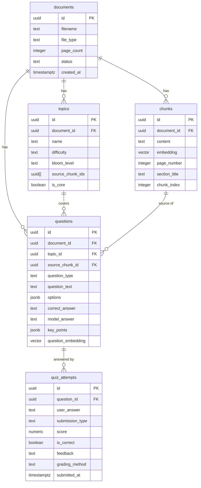
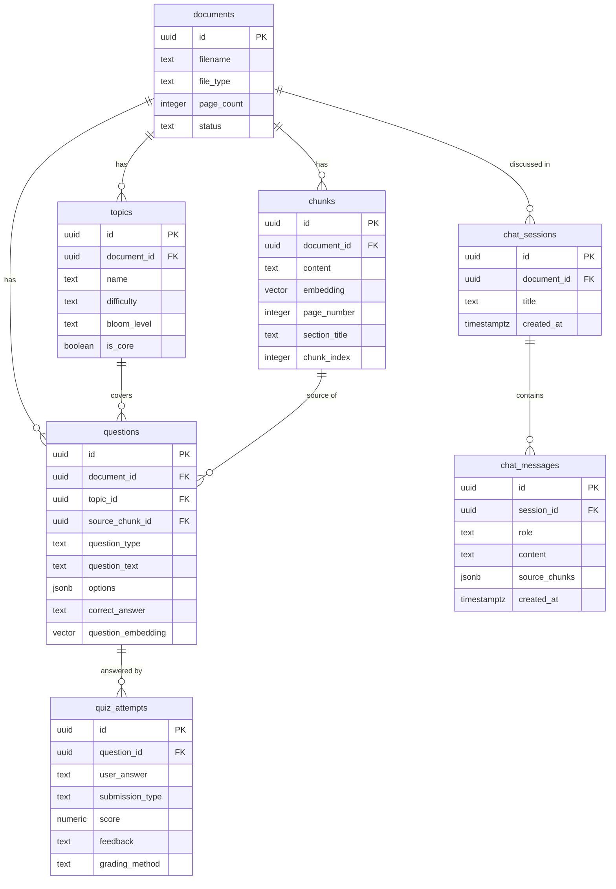

# Thiết kế Database — AI Study Assistant (RAGTutor)

Phân tích từ [Plan.md](file:///d:/Personal%20Project/RAGTutor/Plan.md) và đề xuất schema Supabase (Postgres + pgvector) phục vụ toàn bộ 4 luồng chính của dự án.

> [!IMPORTANT]
> **Cập nhật v2** (14/07/2026): Plan.md đã chuyển frontend từ **Streamlit → ReactJS (Vite)** và thêm **FastAPI backend**. Thay đổi này yêu cầu bổ sung bảng `chat_sessions` để lưu conversation memory — vì React không giữ state qua page refresh (khác Streamlit dùng `st.session_state` trên server).

---

## Tổng quan kiến trúc hệ thống (đã cập nhật)

```
[React Frontend (Vite)] ⇄ REST API (JSON / multipart) ⇄ [FastAPI Backend]
                                                                ↓
                            [LangChain orchestration + Gemini API + Supabase]
```

**Nguyên tắc bảo mật:** mọi API key (Gemini, Supabase service key) chỉ nằm ở **backend FastAPI**, không bao giờ đưa vào code React.

---

## Tổng quan database

Dự án dùng **một database duy nhất** là **Supabase (Postgres + pgvector extension)**.

```
Supabase Postgres
├── documents          ← metadata file upload
├── chunks             ← đoạn văn đã chunk + embedding vector (pgvector)
├── topics             ← chủ đề/khái niệm LLM trích xuất từ chunks
├── questions          ← câu hỏi MCQ + tự luận LLM sinh ra
├── quiz_attempts      ← lịch sử làm bài + kết quả chấm điểm
└── chat_sessions      ← [MỚI] lịch sử hội thoại cho conversation memory
```

### Tại sao cần thêm `chat_sessions`?

Với **Streamlit** cũ: lịch sử chat sống trong `st.session_state` (RAM server) → mất khi rerun, nhưng không cần DB.

Với **React + FastAPI** mới: React là stateless SPA — refresh trang là mất toàn bộ state. FastAPI cũng stateless theo HTTP. Vì vậy **phải lưu lịch sử hội thoại vào Supabase** để:
- Người dùng refresh trang vẫn thấy lại lịch sử chat
- FastAPI truy xuất lại context nhiều lượt khi trả lời câu hỏi tiếp theo (conversation memory)

---

## Proposed Changes

### Bảng 1: `documents` — Quản lý tài liệu upload

Lưu metadata của mỗi file được người dùng nạp vào hệ thống.

```sql
CREATE TABLE documents (
    id          UUID PRIMARY KEY DEFAULT gen_random_uuid(),
    filename    TEXT NOT NULL,                     -- "GiaiTich1.pdf"
    file_type   TEXT NOT NULL,                     -- "pdf" | "docx"
    file_size   INTEGER,                           -- bytes
    page_count  INTEGER,                           -- số trang (nếu có)
    status      TEXT DEFAULT 'pending',            -- "pending" | "processing" | "ready" | "error"
    created_at  TIMESTAMPTZ DEFAULT now()
);
```

**Giải thích từng cột:**
- `id`: UUID (định danh duy nhất), dùng UUID thay INTEGER để dễ mở rộng đa user sau này
- `filename`: tên file gốc người dùng upload — dùng cho UI hiển thị và trích dẫn nguồn
- `file_type`: phân biệt logic xử lý `pdfplumber` vs `python-docx`
- `status`: pipeline trạng thái — khi upload xong mới `"ready"`, nếu lỗi chunking/embedding ghi `"error"` thay vì mất dữ liệu âm thầm
- `page_count`: metadata phụ cho trích dẫn nguồn (vd: "Trang 5/20")

---

### Bảng 2: `chunks` — Lõi của RAG pipeline

Đây là bảng quan trọng nhất. Mỗi dòng là một đoạn văn bản đã qua chunking tự viết + embedding, sẵn sàng cho vector search.

```sql
-- Bật extension pgvector (chạy 1 lần khi setup)
CREATE EXTENSION IF NOT EXISTS vector;

CREATE TABLE chunks (
    id              UUID PRIMARY KEY DEFAULT gen_random_uuid(),
    document_id     UUID NOT NULL REFERENCES documents(id) ON DELETE CASCADE,
    content         TEXT NOT NULL,                  -- nội dung chunk (500-700 từ)
    embedding       VECTOR(384),                    -- vector từ all-MiniLM-L6-v2 (384 chiều)

    -- Metadata cho trích dẫn nguồn (Bước 3 roadmap)
    page_number     INTEGER,                        -- trang trong file gốc
    section_title   TEXT,                           -- tiêu đề chương/mục (nếu detect được)
    chunk_index     INTEGER,                        -- vị trí thứ tự trong file (0, 1, 2...)
    char_start      INTEGER,                        -- vị trí ký tự bắt đầu trong text gốc
    char_end        INTEGER,                        -- vị trí ký tự kết thúc

    created_at      TIMESTAMPTZ DEFAULT now()
);

-- Index vector để tăng tốc similarity search (IVFFlat)
CREATE INDEX ON chunks USING ivfflat (embedding vector_cosine_ops) WITH (lists = 100);
```

**Giải thích thiết kế:**
- `embedding VECTOR(384)`: model `all-MiniLM-L6-v2` xuất ra vector 384 chiều — phải khai báo đúng số chiều
- `ON DELETE CASCADE`: xóa document thì tự xóa tất cả chunks liên quan (tránh dữ liệu rác)
- `page_number`, `section_title`, `char_start/end`: metadata bắt buộc để tính năng trích dẫn nguồn hoạt động (Bước 3)
- **IVFFlat index**: thuật toán approximate nearest neighbor, giúp tìm kiếm vector trong bảng lớn nhanh hơn nhiều so với brute-force. `lists=100` phù hợp khi có ~1.000–10.000 chunks

> [!NOTE]
> LangChain `SupabaseVectorStore` mặc định tìm cột có tên `embedding` và `content` — đặt tên đúng như vậy để khớp mà không cần config thêm.

---

### Bảng 3: `topics` — Chủ đề học tập (Luồng Lộ trình học)

LLM phân tích các chunks và trích xuất danh sách chủ đề/khái niệm, gắn nhãn độ khó và cấp độ Bloom.

```sql
CREATE TABLE topics (
    id              UUID PRIMARY KEY DEFAULT gen_random_uuid(),
    document_id     UUID NOT NULL REFERENCES documents(id) ON DELETE CASCADE,
    name            TEXT NOT NULL,                  -- "Giới hạn hàm số", "Ma trận nghịch đảo"
    description     TEXT,                           -- tóm tắt 1-2 câu về chủ đề

    -- Phân loại cho lộ trình học
    difficulty      TEXT NOT NULL,                  -- "easy" | "medium" | "hard"
    bloom_level     TEXT NOT NULL,                  -- "remember" | "understand" | "apply" | "analyze" | "evaluate"
    
    -- Liên kết chunk nguồn
    source_chunk_ids UUID[],                        -- mảng UUID của các chunk liên quan
    
    -- Trạng thái trong lộ trình học (cho gamification sau này)
    is_core         BOOLEAN DEFAULT false,          -- chủ đề cốt lõi vs nâng cao

    created_at      TIMESTAMPTZ DEFAULT now()
);
```

**Giải thích thiết kế:**
- `bloom_level`: Thang phân loại Bloom (Nhớ → Hiểu → Áp dụng → Phân tích → Đánh giá) — logic lọc lộ trình dựa vào cột này
- `difficulty`: mức độ khó, kết hợp với `bloom_level` để lọc theo mục tiêu điểm
- `source_chunk_ids UUID[]`: mảng UUID thay vì bảng junction (đơn giản hơn, đủ dùng cho portfolio project)
- `is_core`: đánh dấu chủ đề nền tảng — dùng cho lộ trình mục tiêu thấp (chỉ cần học core)

---

### Bảng 4: `questions` — Ngân hàng câu hỏi

LLM sinh câu hỏi MCQ + tự luận từ chunks/topics, lưu kèm đáp án/rubric.

```sql
CREATE TABLE questions (
    id              UUID PRIMARY KEY DEFAULT gen_random_uuid(),
    document_id     UUID NOT NULL REFERENCES documents(id) ON DELETE CASCADE,
    topic_id        UUID REFERENCES topics(id) ON DELETE SET NULL,
    source_chunk_id UUID REFERENCES chunks(id) ON DELETE SET NULL,

    -- Nội dung câu hỏi
    question_type   TEXT NOT NULL,                  -- "mcq" | "essay"
    question_text   TEXT NOT NULL,                  -- nội dung câu hỏi

    -- Dành cho MCQ
    options         JSONB,                          -- {"A": "...", "B": "...", "C": "...", "D": "..."}
    correct_answer  TEXT,                           -- "A" | "B" | "C" | "D"

    -- Dành cho tự luận
    model_answer    TEXT,                           -- đáp án mẫu
    key_points      JSONB,                          -- ["điểm cần đạt 1", "điểm 2", ...]
    rubric          TEXT,                           -- hướng dẫn chấm chi tiết cho LLM-as-judge
    max_score       NUMERIC(5,2) DEFAULT 10.0,

    -- Chống trùng lặp (Bước 7 roadmap)
    question_embedding VECTOR(384),                 -- embed câu hỏi để so sánh tương đồng

    created_at      TIMESTAMPTZ DEFAULT now()
);

-- Index để phát hiện câu hỏi trùng/na ná
CREATE INDEX ON questions USING ivfflat (question_embedding vector_cosine_ops) WITH (lists = 50);
```

**Giải thích thiết kế:**
- `options JSONB` + `correct_answer TEXT`: MCQ lưu 4 lựa chọn dạng JSON — linh hoạt nếu sau này có câu 3 hoặc 5 lựa chọn
- `key_points JSONB`: danh sách các ý cần đạt dạng mảng — LLM-as-judge dùng cột này khi chấm tự luận
- `question_embedding VECTOR(384)`: embedding của nội dung câu hỏi — dùng để detect câu hỏi trùng/na ná (cosine similarity > 0.9 → loại)
- `topic_id` + `source_chunk_id`: truy ngược về nguồn gốc câu hỏi, dùng để hiển thị trích dẫn khi chấm

---

### Bảng 5: `quiz_attempts` — Lịch sử làm bài

Lưu mỗi lần người dùng nộp câu trả lời và kết quả chấm điểm.

```sql
CREATE TABLE quiz_attempts (
    id              UUID PRIMARY KEY DEFAULT gen_random_uuid(),
    question_id     UUID NOT NULL REFERENCES questions(id) ON DELETE CASCADE,

    -- Bài làm của user
    user_answer     TEXT,                           -- text gõ vào hoặc text trích xuất từ ảnh
    submission_type TEXT DEFAULT 'text',            -- "text" | "image_scan"
    image_url       TEXT,                           -- URL ảnh scan (lưu trên Supabase Storage)
    ocr_raw_text    TEXT,                           -- text thô Gemini Vision đọc từ ảnh (trước khi user chỉnh)

    -- Kết quả chấm điểm
    score           NUMERIC(5,2),                   -- điểm số (MCQ: 0 hoặc max_score; tự luận: 0–max_score)
    is_correct      BOOLEAN,                        -- shortcut cho MCQ (true/false)
    feedback        TEXT,                           -- nhận xét của LLM-as-judge (tự luận)
    grading_method  TEXT,                           -- "rule_based" | "llm_as_judge"

    submitted_at    TIMESTAMPTZ DEFAULT now()
);
```

**Giải thích thiết kế:**
- `submission_type`: phân biệt nộp text vs ảnh scan — cần để debug và thống kê sau này
- `image_url` + `ocr_raw_text`: lưu cả ảnh gốc lẫn text thô trước chỉnh sửa — quan trọng để audit độ chính xác OCR
- `grading_method`: minh bạch về cách chấm — MCQ chấm tự động, tự luận do LLM chấm (có thể không nhất quán)
- `feedback TEXT`: nhận xét chi tiết của LLM — "Bạn đã đúng ý 1 và 2, còn thiếu ý 3..."

---

## Sơ đồ quan hệ (ERD)



---

## SQL Script tổng hợp — Chạy trong Supabase SQL Editor

```sql
-- 1. Bật extension
CREATE EXTENSION IF NOT EXISTS vector;

-- 2. Bảng documents
CREATE TABLE documents (
    id          UUID PRIMARY KEY DEFAULT gen_random_uuid(),
    filename    TEXT NOT NULL,
    file_type   TEXT NOT NULL CHECK (file_type IN ('pdf', 'docx')),
    file_size   INTEGER,
    page_count  INTEGER,
    status      TEXT DEFAULT 'pending' CHECK (status IN ('pending', 'processing', 'ready', 'error')),
    created_at  TIMESTAMPTZ DEFAULT now()
);

-- 3. Bảng chunks
CREATE TABLE chunks (
    id              UUID PRIMARY KEY DEFAULT gen_random_uuid(),
    document_id     UUID NOT NULL REFERENCES documents(id) ON DELETE CASCADE,
    content         TEXT NOT NULL,
    embedding       VECTOR(384),
    page_number     INTEGER,
    section_title   TEXT,
    chunk_index     INTEGER NOT NULL,
    char_start      INTEGER,
    char_end        INTEGER,
    created_at      TIMESTAMPTZ DEFAULT now()
);
CREATE INDEX idx_chunks_embedding ON chunks USING ivfflat (embedding vector_cosine_ops) WITH (lists = 100);
CREATE INDEX idx_chunks_document ON chunks (document_id);

-- 4. Bảng topics
CREATE TABLE topics (
    id              UUID PRIMARY KEY DEFAULT gen_random_uuid(),
    document_id     UUID NOT NULL REFERENCES documents(id) ON DELETE CASCADE,
    name            TEXT NOT NULL,
    description     TEXT,
    difficulty      TEXT NOT NULL CHECK (difficulty IN ('easy', 'medium', 'hard')),
    bloom_level     TEXT NOT NULL CHECK (bloom_level IN ('remember', 'understand', 'apply', 'analyze', 'evaluate')),
    source_chunk_ids UUID[],
    is_core         BOOLEAN DEFAULT false,
    created_at      TIMESTAMPTZ DEFAULT now()
);
CREATE INDEX idx_topics_document ON topics (document_id);
CREATE INDEX idx_topics_bloom ON topics (bloom_level, difficulty);

-- 5. Bảng questions
CREATE TABLE questions (
    id                  UUID PRIMARY KEY DEFAULT gen_random_uuid(),
    document_id         UUID NOT NULL REFERENCES documents(id) ON DELETE CASCADE,
    topic_id            UUID REFERENCES topics(id) ON DELETE SET NULL,
    source_chunk_id     UUID REFERENCES chunks(id) ON DELETE SET NULL,
    question_type       TEXT NOT NULL CHECK (question_type IN ('mcq', 'essay')),
    question_text       TEXT NOT NULL,
    options             JSONB,
    correct_answer      TEXT,
    model_answer        TEXT,
    key_points          JSONB,
    rubric              TEXT,
    max_score           NUMERIC(5,2) DEFAULT 10.0,
    question_embedding  VECTOR(384),
    created_at          TIMESTAMPTZ DEFAULT now()
);
CREATE INDEX idx_questions_embedding ON questions USING ivfflat (question_embedding vector_cosine_ops) WITH (lists = 50);
CREATE INDEX idx_questions_document ON questions (document_id);
CREATE INDEX idx_questions_type ON questions (question_type);

-- 6. Bảng quiz_attempts
CREATE TABLE quiz_attempts (
    id              UUID PRIMARY KEY DEFAULT gen_random_uuid(),
    question_id     UUID NOT NULL REFERENCES questions(id) ON DELETE CASCADE,
    user_answer     TEXT,
    submission_type TEXT DEFAULT 'text' CHECK (submission_type IN ('text', 'image_scan')),
    image_url       TEXT,
    ocr_raw_text    TEXT,
    score           NUMERIC(5,2),
    is_correct      BOOLEAN,
    feedback        TEXT,
    grading_method  TEXT CHECK (grading_method IN ('rule_based', 'llm_as_judge')),
    submitted_at    TIMESTAMPTZ DEFAULT now()
);
CREATE INDEX idx_attempts_question ON quiz_attempts (question_id);

-- 7. Bảng chat_sessions [MỚI — cho React + FastAPI]
CREATE TABLE chat_sessions (
    id              UUID PRIMARY KEY DEFAULT gen_random_uuid(),
    document_id     UUID REFERENCES documents(id) ON DELETE SET NULL,
    title           TEXT,                           -- tóm tắt tên phiên chat (tự đặt hoặc lấy câu hỏi đầu tiên)
    created_at      TIMESTAMPTZ DEFAULT now(),
    updated_at      TIMESTAMPTZ DEFAULT now()
);

CREATE TABLE chat_messages (
    id              UUID PRIMARY KEY DEFAULT gen_random_uuid(),
    session_id      UUID NOT NULL REFERENCES chat_sessions(id) ON DELETE CASCADE,
    role            TEXT NOT NULL CHECK (role IN ('user', 'assistant')),
    content         TEXT NOT NULL,                  -- nội dung tin nhắn
    source_chunks   JSONB,                          -- [{"chunk_id": "...", "page": 5, "file": "abc.pdf"}]
    created_at      TIMESTAMPTZ DEFAULT now()
);
CREATE INDEX idx_messages_session ON chat_messages (session_id, created_at);
```

---

## Bảng 6: `chat_sessions` + `chat_messages` [MỚI]

Lưu lịch sử hội thoại đa lượt, bắt buộc khi chuyển sang React + FastAPI.

```sql
-- Chat session: một phiên làm việc của người dùng
CREATE TABLE chat_sessions (
    id              UUID PRIMARY KEY DEFAULT gen_random_uuid(),
    document_id     UUID REFERENCES documents(id) ON DELETE SET NULL,
    title           TEXT,
    created_at      TIMESTAMPTZ DEFAULT now(),
    updated_at      TIMESTAMPTZ DEFAULT now()
);

-- Tin nhắn trong phiên (lưu cả user và assistant)
CREATE TABLE chat_messages (
    id              UUID PRIMARY KEY DEFAULT gen_random_uuid(),
    session_id      UUID NOT NULL REFERENCES chat_sessions(id) ON DELETE CASCADE,
    role            TEXT NOT NULL CHECK (role IN ('user', 'assistant')),
    content         TEXT NOT NULL,
    source_chunks   JSONB,     -- trích dẫn nguồn kèm câu trả lời của assistant
    created_at      TIMESTAMPTZ DEFAULT now()
);
```

**Cách FastAPI dùng bảng này cho conversation memory:**
```python
# Khi user gửi câu hỏi mới → POST /chat
# Backend lấy N tin nhắn gần nhất từ DB:
history = supabase.table("chat_messages")\
    .select("role, content")\
    .eq("session_id", session_id)\
    .order("created_at", desc=True)\
    .limit(10)\
    .execute()
# Đưa history vào prompt → LLM có ngữ cảnh nhiều lượt
```

**Giải thích thiết kế:**
- Tách thành **2 bảng** (session + messages) thay vì 1: dễ liệt kê danh sách phiên chat cũ cho sidebar React mà không phải load toàn bộ tin nhắn
- `source_chunks JSONB`: lưu trích dẫn nguồn ngay trong tin nhắn (thay vì query lại `chunks`) — giúp hiển thị nhanh khi load lại lịch sử
- `document_id` trong `chat_sessions`: biết phiên chat này đang hỏi về tài liệu nào — dùng để filter retrieval đúng document

---

## Sơ đồ quan hệ (ERD) — đầy đủ 6 thực thể



---

## Verification Plan

### Kiểm tra sau khi chạy SQL
1. Vào **Supabase Dashboard → Table Editor** → kiểm tra 5 bảng đã tạo đúng cột và kiểu dữ liệu
2. Vào **Database → Extensions** → kiểm tra `vector` extension đã `Enabled`
3. Vào **Database → Indexes** → xác nhận 3 IVFFlat index cho vector search đã tồn tại

### Test nhanh bằng Python (Bước 1 roadmap)
```python
from supabase import create_client
client = create_client(SUPABASE_URL, SUPABASE_KEY)

# Thử insert 1 document
res = client.table("documents").insert({
    "filename": "test.pdf",
    "file_type": "pdf",
    "status": "ready"
}).execute()
print(res.data)  # Nếu in ra UUID thì thành công
```

---

## Open Questions

> [!IMPORTANT]
> **Câu hỏi 1 — Hỗ trợ đa người dùng (Multi-user)?**
> Plan.md Bước 9 có đề cập dùng Supabase Auth. Nếu có multi-user, cần thêm cột `user_id UUID` vào **tất cả 6 bảng (kể cả chat_sessions)** và bật Row Level Security (RLS) trong Supabase.
> → **Thêm `user_id` ngay từ đầu (dễ mở rộng), hay bỏ qua cho đơn giản?**

> [!NOTE]
> **Câu hỏi 2 — Lưu ảnh scan ở đâu?**
> Cột `image_url` trong `quiz_attempts` cần có chỗ lưu file ảnh thực. Supabase có **Supabase Storage** miễn phí (1GB) tích hợp sẵn. FastAPI sẽ nhận file qua `multipart/form-data` → upload lên Supabase Storage → lưu URL vào DB.
> → **Dùng Supabase Storage, hay tạm thời chỉ lưu text sau OCR (bỏ qua lưu ảnh)?**

> [!NOTE]
> **Câu hỏi 3 — Giữ bao nhiêu tin nhắn trong conversation memory?**
> Khi query lịch sử chat để đưa vào prompt, lấy **10 tin nhắn gần nhất** (5 lượt user-assistant) là con số hợp lý ban đầu. Lấy quá nhiều → tốn token/quota Gemini; lấy quá ít → LLM quên ngữ cảnh.
> → **Dùng mặc định 10 tin nhắn, hay muốn cấu hình linh hoạt?**
