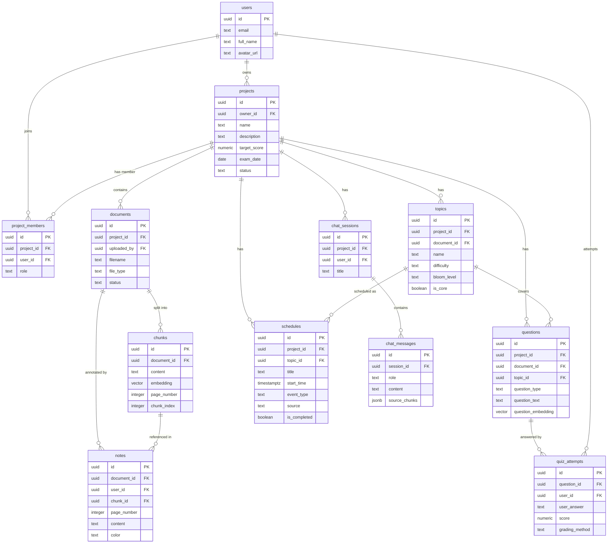

# Thiết kế Database v3 — AI Study Assistant (RAGTutor)

> [!IMPORTANT]
> **Cập nhật v3** (17/07/2026): Tích hợp 3 yêu cầu mới từ người dùng:
> 1. Thêm bảng `users` — quản lý người dùng
> 2. Thêm tính năng lịch học + chia sẻ nhóm (mức Đơn giản: chia sẻ project cho nhiều thành viên, mỗi người học riêng)
> 3. Thêm khái niệm `projects` làm thực thể cha — bao bọc documents, lịch học, chatbot, notes

---

## Thay đổi kiến trúc phân cấp (quan trọng nhất)

```
TRƯỚC (v2):   user_id (cột đơn) → documents → chunks/topics/questions...

SAU (v3):     users
                └── projects          ← thực thể cha MỚI
                      ├── documents   ← tài liệu thuộc project
                      ├── schedules   ← lịch học của project
                      ├── notes       ← annotation trên tài liệu
                      ├── chat_sessions
                      ├── topics / questions / quiz_attempts
                      └── project_members  ← chia sẻ nhóm
```

---

## Tổng quan 11 bảng (tăng từ 7 lên 11)

```
Supabase Postgres
├── users                ← [MỚI] quản lý tài khoản người dùng
├── projects             ← [MỚI] không gian học tập của user
├── project_members      ← [MỚI] chia sẻ project cho thành viên nhóm
├── documents            ← [SỬA] thêm project_id
├── chunks               ← không đổi
├── topics               ← [SỬA] thêm project_id (để query nhanh)
├── questions            ← [SỬA] thêm project_id
├── quiz_attempts        ← [SỬA] thêm user_id (ai làm bài)
├── schedules            ← [MỚI] lịch học / sự kiện
├── chat_sessions        ← [SỬA] thêm project_id, bỏ document_id trực tiếp
└── notes                ← [MỚI] annotation của người dùng trên tài liệu
    chat_messages        ← không đổi (con của chat_sessions)
```

---

## Proposed Changes

---

### Bảng 1 [MỚI]: `users` — Quản lý người dùng

Lưu thông tin tài khoản. Dùng **Supabase Auth** để xử lý đăng ký/đăng nhập — bảng `users` này là bảng **profile** mở rộng, liên kết với `auth.users` của Supabase.

```sql
CREATE TABLE users (
    id          UUID PRIMARY KEY REFERENCES auth.users(id) ON DELETE CASCADE,
    email       TEXT UNIQUE NOT NULL,
    full_name   TEXT,
    avatar_url  TEXT,
    created_at  TIMESTAMPTZ DEFAULT now()
);
```

**Giải thích:**
- `id` trỏ vào `auth.users(id)` của Supabase — không cần tự quản lý password/token, Supabase Auth lo hết
- Khi user đăng ký qua Supabase Auth, trigger tự động tạo dòng trong bảng `users` này
- Bảng này chỉ lưu thông tin hiển thị (profile), không lưu thông tin xác thực

---

### Bảng 2 [MỚI]: `projects` — Không gian học tập

Mỗi project là một "phòng học" độc lập. Người dùng tạo project trước, sau đó upload tài liệu, tạo lịch học, chat trong đó.

```sql
CREATE TABLE projects (
    id              UUID PRIMARY KEY DEFAULT gen_random_uuid(),
    owner_id        UUID NOT NULL REFERENCES users(id) ON DELETE CASCADE,
    name            TEXT NOT NULL,              -- "Ôn thi Giải tích", "Học IELTS tháng 8"
    description     TEXT,
    target_score    NUMERIC(5,2),               -- mục tiêu điểm → dùng cho lộ trình học
    exam_date       DATE,                       -- ngày thi / deadline → AI dùng để lên lịch
    status          TEXT DEFAULT 'active' CHECK (status IN ('active', 'archived')),
    created_at      TIMESTAMPTZ DEFAULT now(),
    updated_at      TIMESTAMPTZ DEFAULT now()
);
CREATE INDEX idx_projects_owner ON projects (owner_id);
```

**Giải thích:**
- `target_score` + `exam_date`: 2 thông tin đầu vào quan trọng nhất để AI lên lịch học và chọn độ sâu lộ trình
- `status = 'archived'`: người dùng có thể lưu trữ project cũ thay vì xóa (giữ lịch sử)
- `owner_id`: người tạo project — phân biệt với thành viên được mời vào

---

### Bảng 3 [MỚI]: `project_members` — Thành viên nhóm học

Cho phép chia sẻ project với người khác. Mỗi người học theo tiến độ riêng.

```sql
CREATE TABLE project_members (
    id          UUID PRIMARY KEY DEFAULT gen_random_uuid(),
    project_id  UUID NOT NULL REFERENCES projects(id) ON DELETE CASCADE,
    user_id     UUID NOT NULL REFERENCES users(id) ON DELETE CASCADE,
    role        TEXT DEFAULT 'member' CHECK (role IN ('owner', 'member')),
    joined_at   TIMESTAMPTZ DEFAULT now(),
    UNIQUE (project_id, user_id)               -- mỗi user chỉ join 1 lần
);
CREATE INDEX idx_members_project ON project_members (project_id);
CREATE INDEX idx_members_user ON project_members (user_id);
```

**Giải thích:**
- `role = 'owner'` | `'member'`: chỉ owner mới xóa project hoặc mời thêm người; member chỉ đọc tài liệu + học
- `UNIQUE (project_id, user_id)`: constraint chống duplicate membership
- Khi tạo project, tự động insert 1 dòng `role = 'owner'` cho người tạo

---

### Bảng 4 [SỬA]: `documents` — Tài liệu trong project

Thêm `project_id` và `user_id` (ai upload).

```sql
CREATE TABLE documents (
    id          UUID PRIMARY KEY DEFAULT gen_random_uuid(),
    project_id  UUID NOT NULL REFERENCES projects(id) ON DELETE CASCADE,  -- [MỚI]
    uploaded_by UUID REFERENCES users(id) ON DELETE SET NULL,             -- [MỚI]
    filename    TEXT NOT NULL,
    file_type   TEXT NOT NULL CHECK (file_type IN ('pdf', 'docx')),
    file_size   INTEGER,
    page_count  INTEGER,
    status      TEXT DEFAULT 'pending' CHECK (status IN ('pending', 'processing', 'ready', 'error')),
    created_at  TIMESTAMPTZ DEFAULT now()
);
CREATE INDEX idx_documents_project ON documents (project_id);
```

---

### Bảng 5: `chunks` — Không đổi

Giữ nguyên, chỉ `document_id` trỏ về `documents` (đã có `project_id`) nên truy ngược được.

---

### Bảng 6 [SỬA]: `topics` — Thêm project_id

```sql
-- Thêm cột project_id vào topics để query nhanh hơn (không cần JOIN qua documents)
ALTER TABLE topics ADD COLUMN project_id UUID REFERENCES projects(id) ON DELETE CASCADE;
```

---

### Bảng 7 [SỬA]: `questions` — Thêm project_id

Tương tự, thêm `project_id` để query toàn bộ câu hỏi trong 1 project mà không cần JOIN nhiều bảng.

```sql
ALTER TABLE questions ADD COLUMN project_id UUID REFERENCES projects(id) ON DELETE CASCADE;
```

---

### Bảng 8 [SỬA]: `quiz_attempts` — Thêm user_id

Cần biết **ai** làm bài trong nhóm học.

```sql
ALTER TABLE quiz_attempts ADD COLUMN user_id UUID REFERENCES users(id) ON DELETE SET NULL;
-- Index để xem lịch sử làm bài của 1 user trong 1 project
CREATE INDEX idx_attempts_user ON quiz_attempts (user_id);
```

---

### Bảng 9 [MỚI]: `schedules` — Lịch học

Hỗ trợ cả 2 chế độ: người dùng tự tạo sự kiện VÀ AI gợi ý lịch dựa trên `exam_date` + `target_score`.

```sql
CREATE TABLE schedules (
    id              UUID PRIMARY KEY DEFAULT gen_random_uuid(),
    project_id      UUID NOT NULL REFERENCES projects(id) ON DELETE CASCADE,
    created_by      UUID REFERENCES users(id) ON DELETE SET NULL,

    title           TEXT NOT NULL,              -- "Ôn chương 3: Tích phân", "Mock test lần 1"
    description     TEXT,
    topic_id        UUID REFERENCES topics(id) ON DELETE SET NULL,  -- gắn với chủ đề cụ thể

    -- Thời gian
    start_time      TIMESTAMPTZ NOT NULL,
    end_time        TIMESTAMPTZ,

    -- Phân loại sự kiện
    event_type      TEXT DEFAULT 'study' CHECK (event_type IN ('study', 'quiz', 'review', 'deadline')),

    -- AI hay người dùng tạo?
    source          TEXT DEFAULT 'manual' CHECK (source IN ('manual', 'ai_suggested')),
    is_completed    BOOLEAN DEFAULT false,

    created_at      TIMESTAMPTZ DEFAULT now()
);
CREATE INDEX idx_schedules_project ON schedules (project_id, start_time);
CREATE INDEX idx_schedules_topic ON schedules (topic_id);
```

**Giải thích:**
- `event_type`: phân biệt buổi học lý thuyết vs làm quiz vs ôn lại vs deadline thi
- `source = 'ai_suggested'`: đánh dấu sự kiện AI tạo ra — user có thể accept/reject/chỉnh sửa
- `topic_id`: liên kết trực tiếp với chủ đề trong lộ trình học — click vào lịch biết học chủ đề gì
- `is_completed`: theo dõi tiến độ hoàn thành lịch học

**Luồng AI lên lịch:**
```
[project.exam_date + project.target_score] → [LLM nhận danh sách topics từ DB]
    → [Phân bổ topics theo số ngày còn lại + độ khó] → [INSERT nhiều dòng vào schedules với source='ai_suggested']
    → [React hiển thị calendar, user chấp nhận/chỉnh sửa]
```

---

### Bảng 10 [SỬA]: `chat_sessions` — Đổi từ document_id sang project_id

Chat trong context của project (có thể hỏi về nhiều tài liệu trong project).

```sql
-- Bảng chat_sessions cập nhật
CREATE TABLE chat_sessions (
    id          UUID PRIMARY KEY DEFAULT gen_random_uuid(),
    project_id  UUID NOT NULL REFERENCES projects(id) ON DELETE CASCADE,  -- [ĐỔI từ document_id]
    user_id     UUID REFERENCES users(id) ON DELETE SET NULL,             -- [MỚI] ai đang chat
    title       TEXT,
    created_at  TIMESTAMPTZ DEFAULT now(),
    updated_at  TIMESTAMPTZ DEFAULT now()
);
```

---

### Bảng 11 [MỚI]: `notes` — Annotation trên tài liệu

Người dùng ghi chú tay, gắn vào trang/đoạn cụ thể trong tài liệu.

```sql
CREATE TABLE notes (
    id              UUID PRIMARY KEY DEFAULT gen_random_uuid(),
    user_id         UUID NOT NULL REFERENCES users(id) ON DELETE CASCADE,
    document_id     UUID NOT NULL REFERENCES documents(id) ON DELETE CASCADE,
    chunk_id        UUID REFERENCES chunks(id) ON DELETE SET NULL,   -- đoạn cụ thể (nếu có)

    page_number     INTEGER,                    -- trang cụ thể trong tài liệu
    content         TEXT NOT NULL,              -- nội dung ghi chú
    color           TEXT DEFAULT 'yellow',      -- màu highlight: "yellow" | "green" | "blue" | "red"
    position_data   JSONB,                      -- vị trí trên trang (x, y, width) cho PDF viewer sau này

    created_at      TIMESTAMPTZ DEFAULT now(),
    updated_at      TIMESTAMPTZ DEFAULT now()
);
CREATE INDEX idx_notes_document ON notes (document_id, page_number);
CREATE INDEX idx_notes_user ON notes (user_id);
```

**Giải thích:**
- `chunk_id`: nếu note gắn vào đoạn text đã được chunk, dễ tra cứu sau này
- `color`: phân loại ghi chú theo màu — người dùng tự quy ước (vd: vàng = quan trọng, xanh = hiểu rồi)
- `position_data JSONB`: lưu tọa độ annotation cho PDF viewer (tính năng nâng cao sau này)

---

## Sơ đồ quan hệ (ERD) — đầy đủ v3



---

## SQL Script đầy đủ v3 — Chạy trong Supabase SQL Editor

```sql
-- =====================================================
-- RAGTutor Database Schema v3
-- =====================================================

-- 0. Bật extensions
CREATE EXTENSION IF NOT EXISTS vector;

-- 1. Bảng users (profile, liên kết với Supabase Auth)
CREATE TABLE users (
    id          UUID PRIMARY KEY REFERENCES auth.users(id) ON DELETE CASCADE,
    email       TEXT UNIQUE NOT NULL,
    full_name   TEXT,
    avatar_url  TEXT,
    created_at  TIMESTAMPTZ DEFAULT now()
);

-- Trigger: tự tạo profile khi user đăng ký qua Supabase Auth
CREATE OR REPLACE FUNCTION public.handle_new_user()
RETURNS TRIGGER AS $$
BEGIN
    INSERT INTO public.users (id, email, full_name)
    VALUES (NEW.id, NEW.email, NEW.raw_user_meta_data->>'full_name');
    RETURN NEW;
END;
$$ LANGUAGE plpgsql SECURITY DEFINER;

CREATE TRIGGER on_auth_user_created
    AFTER INSERT ON auth.users
    FOR EACH ROW EXECUTE FUNCTION public.handle_new_user();

-- 2. Bảng projects
CREATE TABLE projects (
    id              UUID PRIMARY KEY DEFAULT gen_random_uuid(),
    owner_id        UUID NOT NULL REFERENCES users(id) ON DELETE CASCADE,
    name            TEXT NOT NULL,
    description     TEXT,
    target_score    NUMERIC(5,2),
    exam_date       DATE,
    status          TEXT DEFAULT 'active' CHECK (status IN ('active', 'archived')),
    created_at      TIMESTAMPTZ DEFAULT now(),
    updated_at      TIMESTAMPTZ DEFAULT now()
);
CREATE INDEX idx_projects_owner ON projects (owner_id);

-- 3. Bảng project_members
CREATE TABLE project_members (
    id          UUID PRIMARY KEY DEFAULT gen_random_uuid(),
    project_id  UUID NOT NULL REFERENCES projects(id) ON DELETE CASCADE,
    user_id     UUID NOT NULL REFERENCES users(id) ON DELETE CASCADE,
    role        TEXT DEFAULT 'member' CHECK (role IN ('owner', 'member')),
    joined_at   TIMESTAMPTZ DEFAULT now(),
    UNIQUE (project_id, user_id)
);
CREATE INDEX idx_members_project ON project_members (project_id);
CREATE INDEX idx_members_user ON project_members (user_id);

-- 4. Bảng documents
CREATE TABLE documents (
    id          UUID PRIMARY KEY DEFAULT gen_random_uuid(),
    project_id  UUID NOT NULL REFERENCES projects(id) ON DELETE CASCADE,
    uploaded_by UUID REFERENCES users(id) ON DELETE SET NULL,
    filename    TEXT NOT NULL,
    file_type   TEXT NOT NULL CHECK (file_type IN ('pdf', 'docx')),
    file_size   INTEGER,
    page_count  INTEGER,
    status      TEXT DEFAULT 'pending' CHECK (status IN ('pending', 'processing', 'ready', 'error')),
    created_at  TIMESTAMPTZ DEFAULT now()
);
CREATE INDEX idx_documents_project ON documents (project_id);

-- 5. Bảng chunks
CREATE TABLE chunks (
    id              UUID PRIMARY KEY DEFAULT gen_random_uuid(),
    document_id     UUID NOT NULL REFERENCES documents(id) ON DELETE CASCADE,
    content         TEXT NOT NULL,
    embedding       VECTOR(384),
    page_number     INTEGER,
    section_title   TEXT,
    chunk_index     INTEGER NOT NULL,
    char_start      INTEGER,
    char_end        INTEGER,
    created_at      TIMESTAMPTZ DEFAULT now()
);
CREATE INDEX idx_chunks_embedding ON chunks USING ivfflat (embedding vector_cosine_ops) WITH (lists = 100);
CREATE INDEX idx_chunks_document ON chunks (document_id);

-- 6. Bảng topics
CREATE TABLE topics (
    id              UUID PRIMARY KEY DEFAULT gen_random_uuid(),
    project_id      UUID NOT NULL REFERENCES projects(id) ON DELETE CASCADE,
    document_id     UUID NOT NULL REFERENCES documents(id) ON DELETE CASCADE,
    name            TEXT NOT NULL,
    description     TEXT,
    difficulty      TEXT NOT NULL CHECK (difficulty IN ('easy', 'medium', 'hard')),
    bloom_level     TEXT NOT NULL CHECK (bloom_level IN ('remember', 'understand', 'apply', 'analyze', 'evaluate')),
    source_chunk_ids UUID[],
    is_core         BOOLEAN DEFAULT false,
    created_at      TIMESTAMPTZ DEFAULT now()
);
CREATE INDEX idx_topics_project ON topics (project_id);
CREATE INDEX idx_topics_bloom ON topics (bloom_level, difficulty);

-- 7. Bảng questions
CREATE TABLE questions (
    id                  UUID PRIMARY KEY DEFAULT gen_random_uuid(),
    project_id          UUID NOT NULL REFERENCES projects(id) ON DELETE CASCADE,
    document_id         UUID NOT NULL REFERENCES documents(id) ON DELETE CASCADE,
    topic_id            UUID REFERENCES topics(id) ON DELETE SET NULL,
    source_chunk_id     UUID REFERENCES chunks(id) ON DELETE SET NULL,
    question_type       TEXT NOT NULL CHECK (question_type IN ('mcq', 'essay')),
    question_text       TEXT NOT NULL,
    options             JSONB,
    correct_answer      TEXT,
    model_answer        TEXT,
    key_points          JSONB,
    rubric              TEXT,
    max_score           NUMERIC(5,2) DEFAULT 10.0,
    question_embedding  VECTOR(384),
    created_at          TIMESTAMPTZ DEFAULT now()
);
CREATE INDEX idx_questions_embedding ON questions USING ivfflat (question_embedding vector_cosine_ops) WITH (lists = 50);
CREATE INDEX idx_questions_project ON questions (project_id);
CREATE INDEX idx_questions_type ON questions (question_type);

-- 8. Bảng quiz_attempts
CREATE TABLE quiz_attempts (
    id              UUID PRIMARY KEY DEFAULT gen_random_uuid(),
    question_id     UUID NOT NULL REFERENCES questions(id) ON DELETE CASCADE,
    user_id         UUID REFERENCES users(id) ON DELETE SET NULL,
    user_answer     TEXT,
    submission_type TEXT DEFAULT 'text' CHECK (submission_type IN ('text', 'image_scan')),
    image_url       TEXT,
    ocr_raw_text    TEXT,
    score           NUMERIC(5,2),
    is_correct      BOOLEAN,
    feedback        TEXT,
    grading_method  TEXT CHECK (grading_method IN ('rule_based', 'llm_as_judge')),
    submitted_at    TIMESTAMPTZ DEFAULT now()
);
CREATE INDEX idx_attempts_question ON quiz_attempts (question_id);
CREATE INDEX idx_attempts_user ON quiz_attempts (user_id);

-- 9. Bảng schedules
CREATE TABLE schedules (
    id              UUID PRIMARY KEY DEFAULT gen_random_uuid(),
    project_id      UUID NOT NULL REFERENCES projects(id) ON DELETE CASCADE,
    created_by      UUID REFERENCES users(id) ON DELETE SET NULL,
    topic_id        UUID REFERENCES topics(id) ON DELETE SET NULL,
    title           TEXT NOT NULL,
    description     TEXT,
    start_time      TIMESTAMPTZ NOT NULL,
    end_time        TIMESTAMPTZ,
    event_type      TEXT DEFAULT 'study' CHECK (event_type IN ('study', 'quiz', 'review', 'deadline')),
    source          TEXT DEFAULT 'manual' CHECK (source IN ('manual', 'ai_suggested')),
    is_completed    BOOLEAN DEFAULT false,
    created_at      TIMESTAMPTZ DEFAULT now()
);
CREATE INDEX idx_schedules_project ON schedules (project_id, start_time);
CREATE INDEX idx_schedules_topic ON schedules (topic_id);

-- 10. Bảng chat_sessions
CREATE TABLE chat_sessions (
    id          UUID PRIMARY KEY DEFAULT gen_random_uuid(),
    project_id  UUID NOT NULL REFERENCES projects(id) ON DELETE CASCADE,
    user_id     UUID REFERENCES users(id) ON DELETE SET NULL,
    title       TEXT,
    created_at  TIMESTAMPTZ DEFAULT now(),
    updated_at  TIMESTAMPTZ DEFAULT now()
);
CREATE INDEX idx_sessions_project ON chat_sessions (project_id);

-- 11. Bảng chat_messages
CREATE TABLE chat_messages (
    id              UUID PRIMARY KEY DEFAULT gen_random_uuid(),
    session_id      UUID NOT NULL REFERENCES chat_sessions(id) ON DELETE CASCADE,
    role            TEXT NOT NULL CHECK (role IN ('user', 'assistant')),
    content         TEXT NOT NULL,
    source_chunks   JSONB,
    created_at      TIMESTAMPTZ DEFAULT now()
);
CREATE INDEX idx_messages_session ON chat_messages (session_id, created_at);

-- 12. Bảng notes (annotation)
CREATE TABLE notes (
    id              UUID PRIMARY KEY DEFAULT gen_random_uuid(),
    user_id         UUID NOT NULL REFERENCES users(id) ON DELETE CASCADE,
    document_id     UUID NOT NULL REFERENCES documents(id) ON DELETE CASCADE,
    chunk_id        UUID REFERENCES chunks(id) ON DELETE SET NULL,
    page_number     INTEGER,
    content         TEXT NOT NULL,
    color           TEXT DEFAULT 'yellow' CHECK (color IN ('yellow', 'green', 'blue', 'red', 'purple')),
    position_data   JSONB,
    created_at      TIMESTAMPTZ DEFAULT now(),
    updated_at      TIMESTAMPTZ DEFAULT now()
);
CREATE INDEX idx_notes_document ON notes (document_id, page_number);
CREATE INDEX idx_notes_user ON notes (user_id);
```

---

## Row Level Security (RLS) — Bảo mật dữ liệu đa người dùng

Vì có multi-user, cần bật RLS để mỗi user chỉ truy cập đúng dữ liệu của mình:

```sql
-- Bật RLS cho tất cả bảng
ALTER TABLE users ENABLE ROW LEVEL SECURITY;
ALTER TABLE projects ENABLE ROW LEVEL SECURITY;
ALTER TABLE project_members ENABLE ROW LEVEL SECURITY;
ALTER TABLE documents ENABLE ROW LEVEL SECURITY;
ALTER TABLE notes ENABLE ROW LEVEL SECURITY;
-- (thêm tương tự cho các bảng còn lại)

-- Ví dụ policy: user chỉ thấy project mình là thành viên
CREATE POLICY "members_see_project"
ON projects FOR SELECT
USING (
    id IN (
        SELECT project_id FROM project_members
        WHERE user_id = auth.uid()
    )
);

-- User chỉ thấy note của chính mình
CREATE POLICY "own_notes_only"
ON notes FOR ALL
USING (user_id = auth.uid());
```

---

## Verification Plan

### Kiểm tra sau khi chạy SQL
1. **Supabase Dashboard → Table Editor** → kiểm tra 12 bảng (kể cả `chat_messages`) đã tạo đúng
2. **Database → Extensions** → `vector` extension đã `Enabled`
3. **Authentication → Providers** → bật Email/Password provider
4. **Database → Triggers** → trigger `on_auth_user_created` đã tồn tại

### Test luồng cơ bản
```python
# 1. Tạo project
project = supabase.table("projects").insert({
    "owner_id": user_id,
    "name": "Ôn thi Giải tích",
    "exam_date": "2026-08-15",
    "target_score": 8.5
}).execute()

# 2. Thêm owner vào project_members
supabase.table("project_members").insert({
    "project_id": project.data[0]["id"],
    "user_id": user_id,
    "role": "owner"
}).execute()

# 3. Upload document vào project
doc = supabase.table("documents").insert({
    "project_id": project.data[0]["id"],
    "uploaded_by": user_id,
    "filename": "GiaiTich.pdf",
    "file_type": "pdf"
}).execute()
```

---

## Tổng kết thay đổi so với v2

| Bảng | Trạng thái | Thay đổi chính |
|---|---|---|
| `users` | 🆕 Mới | Profile liên kết Supabase Auth |
| `projects` | 🆕 Mới | Thực thể cha chứa toàn bộ |
| `project_members` | 🆕 Mới | Chia sẻ nhóm học |
| `documents` | ✏️ Sửa | Thêm `project_id`, `uploaded_by` |
| `chunks` | ✅ Giữ nguyên | — |
| `topics` | ✏️ Sửa | Thêm `project_id` |
| `questions` | ✏️ Sửa | Thêm `project_id` |
| `quiz_attempts` | ✏️ Sửa | Thêm `user_id` |
| `schedules` | 🆕 Mới | Lịch học manual + AI |
| `chat_sessions` | ✏️ Sửa | Đổi `document_id` → `project_id`, thêm `user_id` |
| `chat_messages` | ✅ Giữ nguyên | — |
| `notes` | 🆕 Mới | Annotation trên tài liệu |
