# Thiết kế Database v5 — AI Study Assistant (RAGTutor)

> [!IMPORTANT]
> **Cập nhật v5 (18/07/2026):** MVP là ứng dụng multi-user và giữ ba chức năng bắt buộc: group invitation, PDF annotation theo tọa độ, chấm ảnh viết tay. Bản v5 đồng thời sửa các lỗi của v4 về LangChain/Supabase schema, RLS, dữ liệu chéo project, versioning, quiz/review và quy định xóa tài liệu là permanent deletion có background cleanup; không có document archive/restore.

---

## 1. Quyết định kiến trúc

- Supabase cung cấp Auth, Postgres/pgvector và private Storage; FastAPI là API duy nhất của ứng dụng React.
- React gửi Supabase access token cho FastAPI. Backend xác minh JWT và kiểm tra project membership trên mọi request.
- Service/secret key chỉ dùng trong backend cho ingestion và tác vụ hệ thống. Vì key này có thể bypass RLS, authorization ở FastAPI vẫn bắt buộc.
- Không dùng trực tiếp schema mặc định của `LangChain SupabaseVectorStore`. Vector được lưu trong `chunks` và truy vấn qua RPC `match_chunks` tùy biến; LangChain chỉ dùng cho prompt, orchestration và structured output.
- File PDF/docx và ảnh bài viết tay nằm trong private buckets. Database chỉ lưu object path; frontend nhận signed URL ngắn hạn sau khi backend kiểm tra quyền.
- Mọi dữ liệu phát sinh từ AI phải lưu `model_name` và `prompt_version` để truy vết và tái lập kết quả.

### Phân quyền MVP

| Hành động | Owner | Member |
|---|---:|---:|
| Xem tài liệu, chat, làm quiz | ✅ | ✅ |
| Tạo/sửa/xóa annotation của chính mình | ✅ | ✅ |
| Upload/version/xóa tài liệu | ✅ | ❌ |
| Sinh topic/question và quản lý lịch chung | ✅ | ❌ |
| Mời/hủy lời mời/xóa member | ✅ | ❌ |
| Xem annotation của người khác | ❌ | ❌ |

Owner luôn có một dòng `project_members.role = 'owner'`. Không hỗ trợ chuyển ownership trong MVP.

---

## 2. Tổng quan 23 bảng

```text
Identity & collaboration
├── users
├── projects
├── project_members
└── project_invitations

Documents & retrieval
├── documents
├── document_versions
├── document_jobs
└── chunks

Knowledge graph
├── topics
├── topic_sources
└── topic_prerequisites

Quiz & review
├── questions
├── question_sources
├── quiz_sessions
├── quiz_attempts
└── review_states

Learning & conversation
├── schedules
├── schedule_completions
├── chat_sessions
├── chat_messages
├── notes
├── study_events
└── progress_snapshots
```

Không dùng UUID array như `topics.source_chunk_ids`; quan hệ source được chuẩn hóa thành link table để có foreign key và cascade rõ ràng.

---

## Sơ đồ quan hệ (ERD) — đầy đủ v5

```mermaid
erDiagram
    users {
        uuid id PK
        citext email UK
        text full_name
        text avatar_url
        text timezone
        timestamptz created_at
        timestamptz updated_at
    }

    projects {
        uuid id PK
        uuid owner_id FK
        text name
        numeric target_score
        date exam_date
        integer weekly_study_minutes
        text status
        timestamptz created_at
        timestamptz updated_at
    }

    project_members {
        uuid id PK
        uuid project_id FK
        uuid user_id FK
        text role
        timestamptz joined_at
    }

    project_invitations {
        uuid id PK
        uuid project_id FK
        uuid invited_by FK
        citext invited_email
        text token_hash UK
        text status
        timestamptz expires_at
        timestamptz accepted_at
        timestamptz created_at
    }

    documents {
        uuid id PK
        uuid project_id FK
        uuid created_by FK
        uuid active_version_id FK
        text display_name
        text status
        timestamptz created_at
        timestamptz updated_at
    }

    document_versions {
        uuid id PK
        uuid document_id FK
        uuid project_id FK
        integer version_number
        text storage_path UK
        text original_filename
        text mime_type
        integer file_size
        integer page_count
        text sha256
        text status
        text summary
        text summary_status
        text embedding_model
        text chunker_version
        timestamptz created_at
        timestamptz processed_at
    }

    document_jobs {
        uuid id PK
        uuid document_id
        uuid document_version_id FK
        text job_type
        text status
        text stage
        integer progress_current
        integer progress_total
        integer attempt_count
        integer max_attempts
        text last_error
        timestamptz created_at
        timestamptz updated_at
    }

    chunks {
        uuid id PK
        uuid project_id FK
        uuid document_id FK
        uuid document_version_id FK
        text content
        vector embedding
        integer page_number
        text section_title
        integer chunk_index
        jsonb source_spans
        integer token_count
        timestamptz created_at
    }

    topics {
        uuid id PK
        uuid project_id FK
        text name
        text description
        text difficulty
        text bloom_level
        boolean is_core
        text model_name
        text prompt_version
        timestamptz created_at
    }

    topic_sources {
        uuid topic_id PK, FK
        uuid chunk_id PK, FK
        numeric relevance
    }

    topic_prerequisites {
        uuid topic_id PK, FK
        uuid prerequisite_topic_id PK, FK
        numeric strength
    }

    questions {
        uuid id PK
        uuid project_id FK
        uuid topic_id FK
        text question_type
        text question_text
        jsonb options
        text correct_answer
        text model_answer
        jsonb key_points
        jsonb rubric
        numeric max_score
        vector question_embedding
        text status
        integer version
        text model_name
        text prompt_version
        timestamptz created_at
    }

    question_sources {
        uuid question_id PK, FK
        uuid chunk_id PK, FK
    }

    quiz_sessions {
        uuid id PK
        uuid project_id FK
        uuid user_id FK
        text status
        uuid_array question_ids
        numeric total_score
        numeric max_score
        timestamptz started_at
        timestamptz submitted_at
        timestamptz graded_at
    }

    quiz_attempts {
        uuid id PK
        uuid quiz_session_id FK
        uuid question_id FK
        uuid user_id FK
        uuid project_id FK
        text submission_type
        text user_answer
        text ocr_raw_text
        text ocr_confirmed_text
        text image_storage_path
        jsonb rubric_snapshot
        numeric score
        boolean is_correct
        text feedback
        text grading_method
        text model_name
        text prompt_version
        text status
        timestamptz submitted_at
        timestamptz graded_at
    }

    review_states {
        uuid id PK
        uuid user_id FK
        uuid question_id FK
        uuid project_id FK
        timestamptz due_at
        integer interval_days
        integer repetitions
        numeric ease_factor
        numeric last_score
        timestamptz last_reviewed_at
    }

    schedules {
        uuid id PK
        uuid project_id FK
        uuid created_by FK
        uuid topic_id FK
        text title
        timestamptz start_time
        timestamptz end_time
        text event_type
        text source
        text suggestion_status
        timestamptz created_at
    }

    schedule_completions {
        uuid id PK
        uuid schedule_id FK
        uuid user_id FK
        timestamptz completed_at
        text note
    }

    chat_sessions {
        uuid id PK
        uuid project_id FK
        uuid user_id FK
        text title
        timestamptz created_at
        timestamptz updated_at
    }

    chat_messages {
        uuid id PK
        uuid session_id FK
        text role
        text content
        text status
        jsonb citations
        jsonb retrieval_params
        text model_name
        text prompt_version
        uuid request_id
        timestamptz created_at
    }

    notes {
        uuid id PK
        uuid user_id FK
        uuid project_id FK
        uuid document_id FK
        uuid document_version_id FK
        integer page_number
        text annotation_type
        text selected_text
        jsonb rectangles
        text content
        text color
        integer version
        timestamptz created_at
        timestamptz updated_at
    }

    study_events {
        uuid id PK
        uuid user_id FK
        uuid project_id FK
        uuid topic_id FK
        text event_type
        integer duration_seconds
        timestamptz occurred_at
        uuid source_id
        text idempotency_key UK
        jsonb metadata
    }

    progress_snapshots {
        uuid id PK
        uuid user_id FK
        uuid project_id FK
        date snapshot_date
        integer questions_attempted
        integer questions_correct
        numeric avg_score
        integer topics_covered
        integer study_minutes
        timestamptz created_at
    }

    users ||--o{ projects : owns
    users ||--o{ project_members : joins
    projects ||--o{ project_members : has
    users ||--o{ project_invitations : creates
    projects ||--o{ project_invitations : has

    users ||--o{ documents : creates
    projects ||--o{ documents : contains
    documents ||--o{ document_versions : versions
    projects ||--o{ document_versions : scopes
    documents ||--o{ document_jobs : processes
    document_versions o|--o{ document_jobs : version_target
    documents ||--o{ chunks : contains
    document_versions ||--o{ chunks : produces
    projects ||--o{ chunks : scopes

    projects ||--o{ topics : contains
    topics ||--o{ topic_sources : cites
    chunks ||--o{ topic_sources : supports
    topics ||--o{ topic_prerequisites : requires
    topics ||--o{ topic_prerequisites : prerequisite

    projects ||--o{ questions : contains
    topics o|--o{ questions : categorizes
    questions ||--o{ question_sources : cites
    chunks ||--o{ question_sources : supports
    projects ||--o{ quiz_sessions : has
    users ||--o{ quiz_sessions : starts
    quiz_sessions ||--o{ quiz_attempts : contains
    questions ||--o{ quiz_attempts : answered_as
    users ||--o{ quiz_attempts : submits
    projects ||--o{ quiz_attempts : scopes
    users ||--o{ review_states : owns
    questions ||--o{ review_states : schedules
    projects ||--o{ review_states : scopes

    projects ||--o{ schedules : contains
    users ||--o{ schedules : creates
    topics o|--o{ schedules : plans
    schedules ||--o{ schedule_completions : completed_as
    users ||--o{ schedule_completions : completes

    projects ||--o{ chat_sessions : contains
    users ||--o{ chat_sessions : owns
    chat_sessions ||--o{ chat_messages : contains

    users ||--o{ notes : writes
    projects ||--o{ notes : scopes
    documents ||--o{ notes : annotates
    document_versions ||--o{ notes : anchors

    users ||--o{ study_events : records
    projects ||--o{ study_events : scopes
    topics o|--o{ study_events : relates_to
    users ||--o{ progress_snapshots : has
    projects ||--o{ progress_snapshots : aggregates
```



ERD thể hiện quan hệ logic và khóa chính/khóa ngoại quan trọng. Các composite foreign key, partial unique index, CHECK constraint và RLS được mô tả chi tiết trong Schema contract bên dưới.

---

## 3. Schema contract

Các migration thực tế phải được lưu thành file versioned. SQL dưới đây là contract về cột, constraint và quan hệ; không chạy lại toàn bộ trên database đã có mà không tạo migration từ v4 → v5.

### 3.1 Identity và collaboration

#### `users`

| Cột | Kiểu | Quy tắc |
|---|---|---|
| `id` | UUID PK | FK `auth.users(id)`; cascade khi xóa tài khoản |
| `email` | CITEXT UNIQUE | Email hiển thị/đối chiếu invitation; lấy từ Auth |
| `full_name`, `avatar_url` | TEXT | Nullable |
| `timezone` | TEXT | IANA timezone, mặc định `Asia/Ho_Chi_Minh` |
| `created_at`, `updated_at` | TIMESTAMPTZ | `updated_at` có trigger |

Trigger tạo profile phải là `SECURITY DEFINER SET search_path = public` và xử lý được trường hợp metadata thiếu.

#### `projects`

| Cột | Kiểu | Quy tắc |
|---|---|---|
| `id` | UUID PK | `gen_random_uuid()` |
| `owner_id` | UUID NOT NULL | FK `users`; owner không được xóa khỏi membership |
| `name`, `description` | TEXT | `name` bắt buộc |
| `target_score` | NUMERIC(5,2) | Nullable, `0 <= target_score <= 100`; UI tự quy đổi thang điểm |
| `exam_date` | DATE | Nullable |
| `weekly_study_minutes` | INTEGER | Nullable, > 0 |
| `status` | TEXT | `active`, `archived` |
| timestamps | TIMESTAMPTZ | Có trigger cập nhật |

Tạo project và owner membership phải nằm trong một database function/transaction.

#### `project_members`

- `id`, `project_id`, `user_id`, `role ('owner','member')`, `joined_at`.
- Unique `(project_id, user_id)` và unique partial `(project_id) WHERE role='owner'`.
- Trigger kiểm tra `projects.owner_id` khớp member có role owner.

#### `project_invitations`

| Cột | Kiểu | Quy tắc |
|---|---|---|
| `project_id`, `invited_by` | UUID | Owner tạo lời mời |
| `invited_email` | CITEXT | Email đích đã normalize |
| `token_hash` | TEXT UNIQUE | Chỉ lưu SHA-256/HMAC; raw token chỉ xuất hiện trong link |
| `status` | TEXT | `pending`, `accepted`, `rejected`, `revoked`, `expired` |
| `expires_at`, `accepted_at`, `created_at` | TIMESTAMPTZ | Link mặc định hết hạn sau 7 ngày |

Unique partial `(project_id, invited_email) WHERE status='pending'`. Accept invitation phải khóa row và chạy transaction: kiểm tra pending, expiry, verified email → upsert membership → cập nhật accepted.

### 3.2 Documents, Storage và retrieval

#### `documents`

Đây là thực thể logic ổn định trong thời gian tài liệu tồn tại, không đại diện một lần upload cụ thể. Tài liệu không có soft delete/archive trong MVP.

- `id`, `project_id`, `created_by`, `display_name`, `status ('active','deleting')`, timestamps.
- Unique `(id, project_id)` để làm đích cho composite foreign key.
- `active_version_id` nullable và được cập nhật chỉ sau khi version mới xử lý thành công.
- Khi bắt đầu xóa, backend chuyển status sang `deleting` trong cùng transaction tạo delete job. `match_chunks` chỉ nhận document `active`, nên tài liệu bị loại khỏi retrieval ngay lập tức.
- Khi cleanup hoàn tất, document record bị xóa; không giữ checksum/tombstone để upload lại có thể tạo document ID mới.

#### `document_versions`

| Cột | Kiểu | Quy tắc |
|---|---|---|
| `id`, `document_id`, `project_id` | UUID | Composite FK đảm bảo document thuộc đúng project |
| `version_number` | INTEGER | Unique `(document_id, version_number)`, bắt đầu từ 1 |
| `storage_path` | TEXT UNIQUE | Object trong bucket `documents` private |
| `original_filename`, `mime_type` | TEXT | Chỉ PDF/DOCX đã kiểm tra MIME thực |
| `file_size`, `page_count` | INTEGER | File size > 0 |
| `sha256` | TEXT | Idempotency và phát hiện upload trùng |
| `status` | TEXT | `pending`, `processing`, `ready`, `error`, `superseded` |
| `summary`, `summary_status` | TEXT | Summary do worker tạo, không gọi Gemini từ DB trigger |
| `embedding_model`, `chunker_version` | TEXT | Không trộn vector khác model/version |
| `error_code`, `error_message` | TEXT | Thông báo vận hành, không chứa secret |
| timestamps | TIMESTAMPTZ | Có `processed_at` |

Unique `(document_id, sha256)` chống ingest cùng nội dung nhiều lần.

#### `document_jobs`

- `id`, `document_id`, `document_version_id`, `job_type ('ingest','delete')`, `status ('queued','running','succeeded','failed','cancelled')`.
- Ingest stages: `store`, `extract`, `chunk`, `embed`, `summarize`, `activate`; delete stages: `exclude`, `cancel_ingest`, `storage`, `derived_data`, `document`, `done`.
- `document_id` là subject ID không có FK để deletion job tối thiểu vẫn tồn tại sau khi document record bị xóa; `document_version_id` nullable và dùng `ON DELETE SET NULL`.
- `progress_current`, `progress_total`, `attempt_count`, `max_attempts`, `last_error`, timestamps phục vụ progress/retry.
- Một version chỉ có tối đa một ingest job chưa kết thúc; một document chỉ có tối đa một delete job chưa kết thúc.
- Retry ingest xóa chunks chưa hoàn tất theo `document_version_id`; retry delete tiếp tục từ stage chưa hoàn thành và phải idempotent.

#### `chunks`

| Cột | Kiểu | Quy tắc |
|---|---|---|
| `id`, `project_id`, `document_id`, `document_version_id` | UUID | Composite FKs chống dữ liệu chéo project/document |
| `content` | TEXT | Không rỗng |
| `embedding` | VECTOR(384) | Cùng model với document version |
| `page_number`, `section_title`, `chunk_index` | INTEGER/TEXT | Unique `(document_version_id, chunk_index)` |
| `source_spans` | JSONB | Danh sách `{page, char_start, char_end}`; hỗ trợ overlap |
| `token_count` | INTEGER | Đo bằng tokenizer embedding model |
| `created_at` | TIMESTAMPTZ | — |

Dùng HNSW cosine index sau khi benchmark. RPC phải filter project và version active trước khi trả kết quả:

```sql
CREATE FUNCTION match_chunks(
    p_project_id UUID,
    p_query_embedding VECTOR(384),
    p_match_count INTEGER DEFAULT 8,
    p_match_threshold DOUBLE PRECISION DEFAULT 0.70
)
RETURNS TABLE (
    id UUID,
    document_id UUID,
    document_version_id UUID,
    content TEXT,
    page_number INTEGER,
    source_spans JSONB,
    similarity DOUBLE PRECISION
)
LANGUAGE sql STABLE SECURITY INVOKER
AS $$
    SELECT c.id, c.document_id, c.document_version_id, c.content,
           c.page_number, c.source_spans,
           1 - (c.embedding <=> p_query_embedding) AS similarity
    FROM chunks c
    JOIN documents d ON d.id = c.document_id
                    AND d.project_id = c.project_id
                    AND d.active_version_id = c.document_version_id
    JOIN document_versions dv ON dv.id = c.document_version_id
    WHERE c.project_id = p_project_id
      AND d.status = 'active'
      AND dv.status = 'ready'
      AND 1 - (c.embedding <=> p_query_embedding) >= p_match_threshold
    ORDER BY c.embedding <=> p_query_embedding
    LIMIT LEAST(p_match_count, 50);
$$;
```

Backend vẫn kiểm tra caller là member trước khi gọi RPC. Không cấp execute cho `anon`.

### 3.3 Topics và knowledge graph

#### `topics`

- `id`, `project_id`, `name`, `description`, `difficulty`, `bloom_level`, `is_core`, `model_name`, `prompt_version`, timestamps.
- Topic ở cấp project, không bắt buộc thuộc đúng một document để hỗ trợ multi-document roadmap.

#### `topic_sources`

- `topic_id`, `chunk_id`, `relevance`; composite PK `(topic_id, chunk_id)`; FK tới chunk dùng `ON DELETE CASCADE`.
- Trigger/composite constraint đảm bảo topic và chunk cùng project.
- Sau permanent delete, topic không còn source sẽ bị xóa khỏi nội dung active; `schedules.topic_id` dùng `ON DELETE SET NULL` để không xóa lịch sử lịch học.

#### `topic_prerequisites`

- `topic_id`, `prerequisite_topic_id`, `strength`; composite PK.
- FK tới topic dùng `ON DELETE CASCADE`; không cho self-reference; service phải phát hiện cycle trước khi lưu roadmap.

### 3.4 Question, quiz và spaced repetition

#### `questions`

- `id`, `project_id`, `topic_id`, `question_type ('mcq','essay')`, `question_text`.
- `options JSONB`, `correct_answer`, `model_answer`, `key_points JSONB`, `rubric JSONB`, `max_score`.
- `question_embedding VECTOR(384)`, `status ('active','retired')`, `version`, `model_name`, `prompt_version`, timestamps.
- Không cascade lịch sử khi retire/re-upload. Question cũ được giữ ở trạng thái retired.
- CHECK theo loại: MCQ cần 4 options và correct answer; essay cần rubric/key points.

#### `question_sources`

- `question_id`, `chunk_id`; composite PK và constraint cùng project; FK tới chunk dùng `ON DELETE CASCADE`.
- Cho phép một question tổng hợp evidence từ nhiều chunk/document.
- Khi xóa document, question mất toàn bộ source sẽ bị xóa khỏi question bank. `quiz_attempts.question_id` dùng `ON DELETE SET NULL` và attempt snapshot giữ nguyên lịch sử.

#### `quiz_sessions`

| Cột | Kiểu | Quy tắc |
|---|---|---|
| `id`, `project_id`, `user_id` | UUID | Một lần làm bài của một user |
| `status` | TEXT | `in_progress`, `submitted`, `graded`, `abandoned` |
| `question_ids` | UUID[] | Snapshot thứ tự câu tại lúc bắt đầu; chỉ chứa question cùng project |
| `started_at`, `submitted_at`, `graded_at` | TIMESTAMPTZ | — |
| `total_score`, `max_score` | NUMERIC | Tổng từ attempts |

Không thêm/xóa câu khỏi session sau khi bắt đầu. `question_ids` là snapshot thứ tự; ID đã bị xóa có thể còn trong session lịch sử nhưng UI dựng nội dung từ `quiz_attempts` snapshot.

#### `quiz_attempts`

Mỗi row là câu trả lời cho một question trong quiz session.

- `id`, `quiz_session_id`, `question_id` nullable, `user_id`, `project_id`; unique `(quiz_session_id, question_id)` cho question còn tồn tại.
- `question_id` dùng `ON DELETE SET NULL`; xóa question nguồn không được cascade vào attempt.
- Snapshot bắt buộc: `question_text_snapshot`, `options_snapshot`, `rubric_snapshot`, `max_score_snapshot`.
- `submission_type ('text','image_scan')`, `user_answer`, `ocr_raw_text`, `ocr_confirmed_text`.
- `image_storage_path` trỏ bucket private; `image_deleted_at` cho phép xóa ảnh nhưng giữ kết quả.
- `ocr_uncertain_regions JSONB`, `score`, `is_correct`, `feedback`, `grading_method`.
- `model_name`, `prompt_version`, `status ('draft','ocr_pending_confirmation','submitted','graded','error')`, timestamps.
- Chỉ chấm image scan khi status đã qua bước xác nhận OCR.

#### `review_states`

- `user_id`, `question_id`, `project_id` là unique state cho một user-question.
- FK `question_id` dùng `ON DELETE CASCADE`; khi question mất toàn bộ nguồn và bị xóa, lịch ôn tương lai của question đó cũng bị xóa.
- `due_at`, `interval_days`, `repetitions`, `ease_factor`, `last_score`, `last_reviewed_at`.
- Update state sau attempt graded trong transaction; không lưu due date trên từng attempt.
- Danh sách đến hạn được query khi mở app hoặc bằng Supabase Cron/worker thật, không chạy cron trong process FastAPI free-tier.

### 3.5 Lịch, chat, annotation và progress

#### `schedules`

- `id`, `project_id`, `created_by`, `topic_id`, title/description, start/end time.
- `event_type ('study','quiz','review','deadline')`, `source ('manual','ai_suggested')`.
- `suggestion_status ('suggested','accepted','rejected')`; manual event mặc định accepted.
- CHECK `end_time IS NULL OR end_time > start_time`.

#### `schedule_completions`

- `schedule_id`, `user_id`, `completed_at`, `note`; unique `(schedule_id, user_id)`.
- Chỉ member của project chứa schedule được tạo completion.

#### `chat_sessions` và `chat_messages`

- Session: `id`, `project_id`, `user_id`, title, timestamps.
- Message: `session_id`, `role ('user','assistant','system')`, `content`, `status`, timestamps.
- Assistant message lưu `citations JSONB`, `retrieval_params JSONB`, `model_name`, `prompt_version` và `request_id`.
- Citations chứa immutable `document_version_id`, `chunk_id`, file/page/source spans và similarity.
- Trước khi xóa chunks/version, delete worker cập nhật citation liên quan thành `source_status='deleted'`, bỏ mọi storage path/signed URL. Nội dung user/assistant message vẫn được giữ và UI hiển thị “Nguồn đã bị xóa”.

#### `notes` — PDF annotation riêng tư

| Cột | Kiểu | Quy tắc |
|---|---|---|
| `id`, `user_id`, `project_id`, `document_id`, `document_version_id` | UUID | Composite FKs chống annotation chéo project/version |
| `page_number` | INTEGER | >= 1 |
| `annotation_type` | TEXT | `text_highlight` hoặc `rectangle` |
| `selected_text` | TEXT | Nullable cho rectangle |
| `rectangles` | JSONB | Mảng `{x,y,width,height}` chuẩn hóa trong khoảng `0..1` |
| `content` | TEXT | Note của user, có thể rỗng nếu chỉ highlight |
| `color` | TEXT | Danh sách màu cho phép |
| timestamps | TIMESTAMPTZ | Có optimistic `version` hoặc `updated_at` check |

RLS chỉ cho `user_id = auth.uid()` đọc/ghi. Annotation luôn gắn document version cũ; không tự chuyển tọa độ khi có version mới.

#### `study_events`

- Dữ liệu activity thô: `user_id`, `project_id`, `event_type`, `topic_id`, `duration_seconds`, `occurred_at`, `source_id`, `metadata`.
- Unique idempotency key cho event phát sinh từ quiz/schedule để retry không cộng hai lần.

#### `progress_snapshots`

- `user_id`, `project_id`, `snapshot_date`, attempted/correct/avg score/topics covered/study minutes.
- Unique `(user_id, project_id, snapshot_date)`.
- Là aggregate cache từ quiz sessions, review states, schedule completions và study events; job phải có thể rebuild toàn bộ ngày, không cộng dồn mù quáng.

---

## 4. Storage design

### Bucket `documents` — private

```text
projects/{project_id}/documents/{document_id}/versions/{version_id}/{safe_filename}
```

Chỉ owner upload/delete. Member nhận signed URL sau khi backend xác nhận membership.

### Permanent document deletion

Nút **Xóa tài liệu** luôn là xóa vĩnh viễn; document không có archive/restore. API trả `202 Accepted` và worker thực hiện theo thứ tự idempotent:

1. Trong transaction: kiểm tra owner, chuyển `documents.status='deleting'`, đặt `active_version_id=NULL`, tạo `document_jobs(job_type='delete')` và hủy/cancel ingest job đang chạy.
2. Từ thời điểm này `match_chunks` không còn trả tài liệu vì chỉ query document `active`.
3. Đánh dấu citations trong chat là `source_deleted`; giữ nguyên nội dung chat.
4. Xóa objects của mọi document version trong bucket `documents`; signed URL cũ không còn đọc được object sau cleanup.
5. Xóa notes/annotations, topic/question source links, chunks, summary, document versions và ingest job data.
6. Xóa topic không còn source (`schedules`/`study_events` giữ lịch sử với `topic_id=NULL`). Xóa question không còn source khỏi question bank; review state tương lai bị xóa, còn `quiz_attempts` được giữ bằng snapshot và `question_id` chuyển `NULL`.
7. Xóa document record và đánh dấu delete job `succeeded`. Job chỉ giữ subject ID, trạng thái và lỗi vận hành, không giữ filename, checksum hay nội dung.

Nếu một bước thất bại, document vẫn ở `deleting`, bị loại khỏi retrieval và worker retry từ stage chưa hoàn thành. Request xóa lặp lại trả cùng delete job. Chỉ cho upload lại file sau khi job kết thúc; lần upload đó luôn tạo document mới + version 1 và chạy lại extract/chunk/embed.

### Bucket `quiz-submissions` — private

```text
users/{user_id}/projects/{project_id}/quiz-sessions/{session_id}/{attempt_id}.{ext}
```

- Chỉ chấp nhận JPEG/PNG/WebP sau khi kiểm tra MIME thực và giới hạn dung lượng.
- Signed URL có thời hạn ngắn, không lưu public URL trong database.
- API xóa ảnh xóa Storage object và set `image_storage_path = NULL`, `image_deleted_at = now()`; vẫn giữ OCR confirmed text, score và feedback.
- Job reconciliation định kỳ phát hiện orphan object hoặc database row trỏ tới object không tồn tại.

---

## 5. RLS và authorization

### Helper functions

Tạo các function trong schema không expose trực tiếp, dùng `SECURITY DEFINER SET search_path` cố định:

- `is_project_member(project_id, user_id)`.
- `is_project_owner(project_id, user_id)`.
- `create_project_with_owner(...)`.
- `accept_project_invitation(raw_token)`; function hash token, lock row và kiểm tra verified email.

### Policy matrix

| Nhóm bảng | SELECT | INSERT/UPDATE/DELETE |
|---|---|---|
| Project và nội dung học chung | Project member | Owner; riêng chat/attempt/completion theo user |
| Invitations | Owner; người nhận chỉ qua accept function | Owner tạo/revoke; accept qua function |
| Notes | Chính user | Chính user và phải là project member |
| Quiz sessions/attempts/review states | Chính user | Chính user; grading field chỉ backend/system cập nhật |
| Progress/study events | Chính user | Backend/system; user không sửa aggregate trực tiếp |
| Chunks/jobs/document versions | Project member đọc bản ready; owner xem job progress | Owner tạo ingest/delete request; worker/service xử lý |

Tất cả 23 bảng trong `public` phải `ENABLE ROW LEVEL SECURITY`; không để placeholder “thêm tương tự”. Migration test phải chạy bằng anon, authenticated user A/B, owner, member và service role.

---

## 6. API/data-flow bắt buộc

### Invitation

```text
POST /projects/{id}/invitations
GET  /projects/{id}/invitations
DELETE /projects/{id}/invitations/{invitation_id}
GET  /invitations/{raw_token}
POST /invitations/{raw_token}/accept
POST /invitations/{raw_token}/reject
```

Không trả `token_hash` qua API. Endpoint preview chỉ trả project name, inviter và expiry sau khi token hợp lệ.

### Documents và jobs

```text
POST /projects/{id}/documents
POST /documents/{id}/versions
GET  /document-jobs/{job_id}
POST /document-jobs/{job_id}/retry
GET  /document-versions/{id}/signed-url
DELETE /projects/{project_id}/documents/{document_id}
```

Upload trả `202 Accepted` cùng `document_id`, `version_id`, `job_id`; không giữ HTTP request đến khi embedding xong.

Delete chỉ dành cho owner, luôn có nghĩa xóa vĩnh viễn và trả `202 Accepted` cùng `job_id`. Hai request đồng thời/lặp lại phải nhận cùng delete job đang chạy; không có endpoint restore document.

### Annotation

```text
GET    /document-versions/{id}/annotations?page={n}
POST   /document-versions/{id}/annotations
PATCH  /annotations/{id}
DELETE /annotations/{id}
```

Payload rectangle dùng số chuẩn hóa `0..1`; backend validate mọi tọa độ và page number.

### Quiz và ảnh viết tay

```text
POST /projects/{id}/quiz-sessions
POST /quiz-sessions/{id}/answers
POST /quiz-sessions/{id}/answers/scan
POST /quiz-sessions/{id}/answers/{attempt_id}/confirm-ocr
DELETE /quiz-attempts/{attempt_id}/image
POST /quiz-sessions/{id}/submit
```

Upload scan trả attempt ở trạng thái `ocr_pending_confirmation`. Confirm OCR mới chuyển sang submitted/grading. Các endpoint dùng idempotency key.

---

## 7. Migration từ v4 và thứ tự triển khai

1. Chụp schema hiện tại và tạo migration versioned; không chạy script `CREATE TABLE` cũ trên database đang có.
2. Tạo extensions `vector`, `citext`, helper functions và trigger timestamps.
3. Tạo bảng mới, backfill `documents` thành logical document + version 1 và chuyển job ingestion cũ sang `document_jobs(job_type='ingest')`.
4. Chuyển chunk sang `document_version_id`, `source_spans` và model metadata; re-embed bằng multilingual model trước khi bật version active.
5. Chuyển `topics.source_chunk_ids` và question source đơn thành link tables.
6. Tạo quiz sessions cho attempt cũ theo từng user/time window; snapshot question/rubric.
7. Chuyển due date mới nhất của mỗi user-question sang `review_states`; bỏ due date khỏi attempt sau khi kiểm chứng.
8. Chuyển `notes.position_data` sang rectangles chuẩn hóa nếu dữ liệu cũ có đủ page dimensions; nếu không, giữ legacy read-only.
9. Bật RLS và policies trong cùng release với backend authorization; chạy test hai user trước khi deploy.
10. Sau khi đối chiếu row counts và test rollback, mới xóa cột v4 không còn dùng.

---

## 8. Verification và acceptance tests

### Schema/integrity

- Có đúng 23 bảng ứng dụng, tất cả bật RLS và không có policy placeholder.
- Không insert được chunk/topic/question/note có project hoặc document version không khớp.
- Một project chỉ có một owner; một email/project chỉ có một invitation pending.
- Retry ingest/delete job không tạo duplicate version/chunk hoặc cleanup trùng.

### Authorization

- User ngoài project không đọc được project, file, chunks, chat, quiz, lịch hoặc signed URL.
- Member đọc tài liệu nhưng không upload/xóa, sinh question, sửa lịch chung hoặc mời người.
- Owner không đọc được annotation hay ảnh bài làm riêng của member ngoài các dữ liệu kết quả được sản phẩm cho phép.

### Retrieval/versioning

- `match_chunks` không trả dữ liệu chéo project, version superseded hoặc document `deleting`.
- Citation mở đúng file, version, trang và source spans.
- Retire question/version không làm thay đổi lịch sử quiz.

### Permanent document deletion

- Chỉ owner xóa được; member/user ngoài project nhận `403`.
- Document bị loại khỏi retrieval ngay khi delete job được tạo, kể cả cleanup chưa hoàn tất.
- Xóa khi ingest đang chạy phải cancel ingest và không để lại chunks, annotations hoặc Storage object.
- Hai request xóa đồng thời/lặp lại trả cùng delete job; retry tiếp tục đúng stage và không lỗi nếu object/row đã bị xóa.
- Chat message được giữ, citation chuyển `source_deleted` và không thể lấy signed URL.
- Question/topic mất toàn bộ nguồn bị loại khỏi nội dung active; quiz attempts/scores/rubric snapshots vẫn đọc được.
- Sau cleanup không còn file, version, summary, chunks, annotation hay ingest data của document.
- Upload lại cùng file sau job thành công tạo document ID mới, version 1 mới và embeddings mới.

### Invitation

- Token sai, hết hạn, revoked, dùng lại hoặc email không khớp đều bị từ chối.
- Hai request accept đồng thời chỉ tạo một membership.

### Annotation

- Rectangles giữ đúng vị trí sau reload, zoom và resize.
- Hai user annotation cùng trang không nhìn thấy dữ liệu của nhau.
- Annotation version cũ vẫn mở đúng PDF cũ sau khi upload version mới.

### Ảnh viết tay

- File giả MIME, quá dung lượng hoặc sai định dạng bị chặn trước OCR.
- Ảnh không có URL public; signed URL hết hạn và không dùng được bởi user ngoài project.
- Không thể chấm trước bước xác nhận OCR; retry không tạo file/attempt trùng.
- Xóa ảnh làm object không còn truy cập được nhưng giữ confirmed text, score và feedback.

### Progress/review

- Mỗi user-question có đúng một review state và không tạo nhiều lịch ôn trùng.
- Rebuild progress snapshot từ activity thô cho kết quả giống dashboard hiện tại.

---

## 9. Ngoài MVP

- Export báo cáo PDF.
- XP, checkpoint mở khóa và leaderboard.
- Chia sẻ annotation giữa thành viên.
- Vẽ tự do trên PDF.
- Tự động chuyển annotation sang tọa độ của document version mới.
