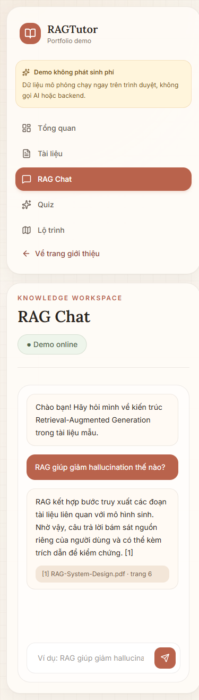
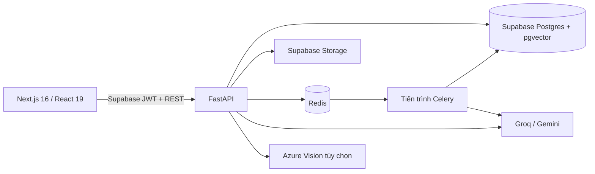

# RAGTutor

RAGTutor là trợ lý học tập dùng kỹ thuật sinh nội dung có tăng cường truy xuất (RAG) để biến tài liệu PDF/DOCX thành không gian hỏi đáp có trích dẫn, bài kiểm tra, lộ trình học và báo cáo tiến độ.

[Xem bản demo](https://frontend-psi-dusky-79.vercel.app/demo) · [Mã nguồn](https://github.com/datnt-numenor/RAG-Tutor)

> **Trạng thái triển khai:** `/demo` là bản mô phỏng chạy hoàn toàn trong trình duyệt, không cần tài khoản và không gọi máy chủ hoặc AI. Máy chủ, tiến trình Celery và Redis trên môi trường vận hành hiện không được duy trì trực tuyến để tránh chi phí. Các chức năng đầy đủ bên dưới cần chạy trên máy cá nhân hoặc triển khai lại hạ tầng.

<p align="center">
  
</p>

## Chức năng

| Nhóm | Khả năng | Bản demo công khai | Hệ thống đầy đủ |
|---|---|:---:|:---:|
| Tài liệu | Tải lên PDF/DOCX, quản lý phiên bản, xử lý nền | Mô phỏng | Có |
| Hỏi đáp RAG | Truy xuất theo dự án, trả lời kèm tài liệu và trang nguồn | Mô phỏng | Có |
| PDF | Đọc tài liệu, chọn văn bản, đánh dấu và ghi chú | Một phần | Có |
| Bài kiểm tra | Câu hỏi trắc nghiệm/tự luận, chấm điểm, ôn tập ngắt quãng | Mô phỏng | Có |
| OCR | Nhận dạng bài làm ảnh, cho sửa trước khi chấm | Không | Có |
| Lộ trình | Sinh chủ đề, quan hệ tiên quyết và lịch học | Mô phỏng | Có |
| Tiến độ | Tổng hợp hoạt động, bài kiểm tra và lịch học | Mô phỏng | Có |
| Cộng tác | Thành viên dự án, lời mời và phân quyền | Không | Có |

## Kiến trúc



Luồng nhập tài liệu chính:

```text
PDF/DOCX → kho lưu trữ riêng tư → Celery → trích xuất → chia đoạn → tạo vector → pgvector
```

## Công nghệ

- Giao diện: Next.js 16, React 19, TypeScript, Tailwind CSS 4, TanStack Query.
- Máy chủ: Python 3.12, FastAPI, Pydantic, Celery.
- Dữ liệu và xác thực: Supabase Auth, PostgreSQL, pgvector, kho lưu trữ riêng tư và RLS.
- AI: Groq tạo văn bản khi có cấu hình, Gemini là phương án dự phòng; Azure Vision hỗ trợ OCR tùy chọn.
- Truy xuất: `paraphrase-multilingual-MiniLM-L12-v2`, vector 384 chiều.
- Hạ tầng: Redis, Docker Compose, GitHub Actions, Vercel.

## Cấu trúc kho mã nguồn

```text
RAGTutor/
├── backend/
│   ├── app/api/v1/       # Các điểm cuối FastAPI
│   ├── app/services/     # RAG, nhập liệu, bài kiểm tra, OCR, lộ trình
│   ├── app/workers/      # Các tác vụ Celery
│   ├── migrations/       # Lược đồ SQL, pgvector và RLS
│   ├── scripts/          # Kiểm thử đầu-cuối và bảo mật
│   └── tests/            # Kiểm thử tự động
├── frontend/
│   └── src/
│       ├── app/          # Bộ định tuyến ứng dụng Next.js
│       ├── components/
│       └── lib/
├── .github/workflows/    # Tích hợp liên tục và kiểm thử đầu-cuối
└── docker-compose.yml
```

## Chạy nhanh bản demo

Yêu cầu Node.js 22 và npm.

```powershell
Set-Location frontend
npm.cmd ci
npm.cmd run dev
```

Mở `http://localhost:3000/demo`. Đường dẫn này dùng dữ liệu mẫu và không cần tệp môi trường.

## Chạy toàn bộ hệ thống trên máy cá nhân

### 1. Yêu cầu

- Python 3.12;
- Node.js 22;
- Docker Desktop hoặc một dịch vụ Redis;
- một dự án Supabase đã áp dụng các tệp SQL trong `backend/migrations/` theo thứ tự tên;
- khóa API Gemini; Groq và Azure Vision là tùy chọn.

### 2. Tạo môi trường

Chạy từ thư mục gốc của kho mã nguồn:

```powershell
py -3.12 -m venv .venv
.\.venv\Scripts\python.exe -m pip install --upgrade pip
.\.venv\Scripts\python.exe -m pip install -r backend\requirements.txt

Copy-Item backend\.env.example backend\.env
Copy-Item frontend\.env.example frontend\.env.local
```

Điền các giá trị mẫu trong hai tệp vừa tạo. Không đưa `.env`, mật khẩu cơ sở dữ liệu, khóa API hoặc khóa `service_role` của Supabase lên Git.

Các biến máy chủ bắt buộc được mô tả trong `backend/.env.example`. Ba biến công khai của giao diện nằm trong `frontend/.env.example`.

### 3. Khởi động các dịch vụ

Redis:

```powershell
docker compose up -d redis
```

FastAPI:

```powershell
.\.venv\Scripts\python.exe -m uvicorn main:app --app-dir backend --reload
```

Tiến trình Celery trong một cửa sổ lệnh khác:

```powershell
Set-Location backend
..\.venv\Scripts\python.exe -m celery -A app.workers.celery_app.celery_app worker --loglevel=info --pool=solo
```

Giao diện trong một cửa sổ lệnh khác:

```powershell
Set-Location frontend
npm.cmd ci
npm.cmd run dev
```

Sau đó mở:

- Trang web: `http://localhost:3000`
- Swagger: `http://127.0.0.1:8000/docs`
- Trạng thái API: `http://127.0.0.1:8000/health`
- Mức sẵn sàng của các dịch vụ phụ thuộc: `http://127.0.0.1:8000/health/ready`

## Kiểm thử

Máy chủ:

```powershell
.\.venv\Scripts\python.exe -m pytest backend\tests -q --basetemp=backend\.pytest-tmp -p no:cacheprovider
```

Giao diện:

```powershell
Set-Location frontend
npm.cmd run lint
npm.cmd run build
```

Các bài kiểm thử đầu-cuối trong `backend/scripts/` cần máy chủ, Redis, tiến trình Celery, Supabase và tài khoản kiểm thử riêng. Không dùng tài khoản hoặc dữ liệu thật cho các tập lệnh này.

## Biến môi trường và bảo mật

- `SUPABASE_SERVICE_KEY`, mật khẩu cơ sở dữ liệu và các khóa AI chỉ được đặt ở máy chủ hoặc kho bí mật của nhà cung cấp lưu trữ.
- Giao diện chỉ nhận các biến bắt đầu bằng `NEXT_PUBLIC_`; khóa công khai/ẩn danh của Supabase không thay thế cho RLS.
- Bật RLS cho mọi bảng công khai và kiểm tra chính sách cho từng vai trò trước khi triển khai.
- Kho lưu trữ chứa tài liệu phải ở chế độ riêng tư; trình khách lấy tệp qua đường dẫn ký số có thời hạn.
- Không đưa mã truy cập, trạng thái đăng nhập của Playwright, nhật ký hoặc ảnh kiểm thử tạm lên Git.

## Triển khai

- Bản demo hồ sơ năng lực hiện được triển khai trực tiếp trên Vercel.
- Hệ thống đầy đủ cần bốn thành phần: giao diện, FastAPI API, tiến trình Celery và Redis; Supabase cung cấp xác thực, Postgres/pgvector và lưu trữ tệp.
- `frontend/vercel.json`, các `Dockerfile`, `docker-compose.yml` và `render.yaml` là cấu hình triển khai tham khảo.
- Sau khi triển khai lại, cập nhật `NEXT_PUBLIC_API_BASE_URL`, `ALLOWED_ORIGINS` và chạy kiểm thử đầu-cuối cơ bản trước khi công bố đường dẫn.

## Giới hạn hiện tại

- Bản demo công khai dùng dữ liệu mô phỏng; không chứng minh kết nối vận hành thật với AI hoặc cơ sở dữ liệu.
- Chưa công bố bộ đánh giá cố định cho độ chính xác truy xuất, OCR, chấm tự luận hoặc độ trễ.
- Hệ thống đầy đủ trên môi trường vận hành hiện ngoại tuyến, vì vậy các trang đăng nhập và bảng điều khiển thật không hoạt động trên bản demo.

## Giấy phép

Kho mã nguồn hiện chưa có tệp giấy phép. Mã nguồn không mặc nhiên được cấp quyền sử dụng lại cho đến khi một giấy phép được bổ sung.
